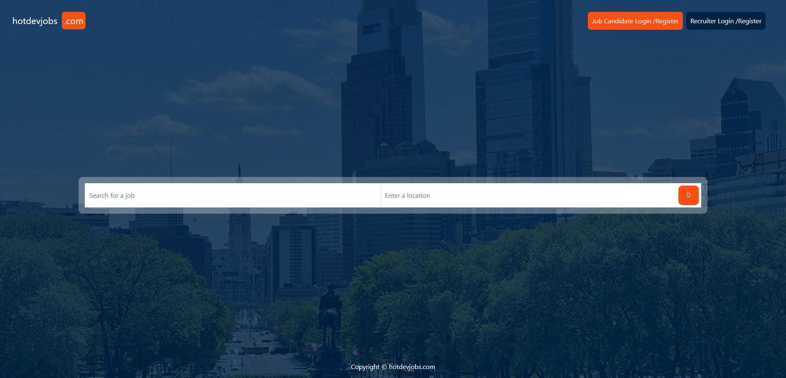
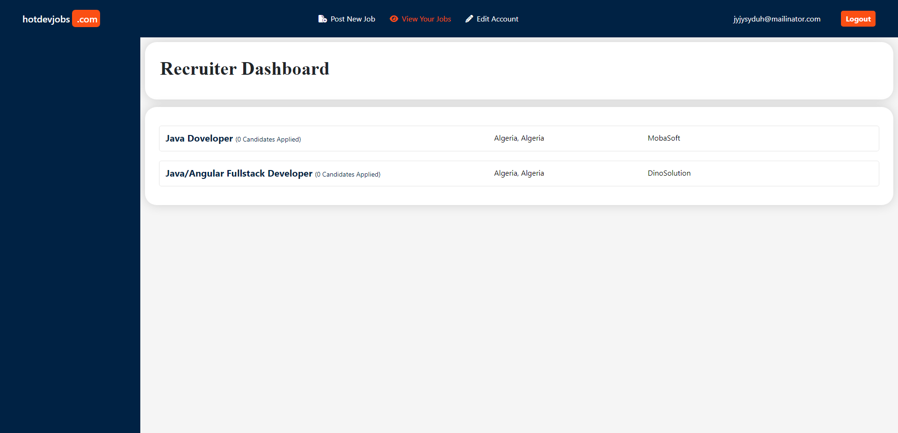
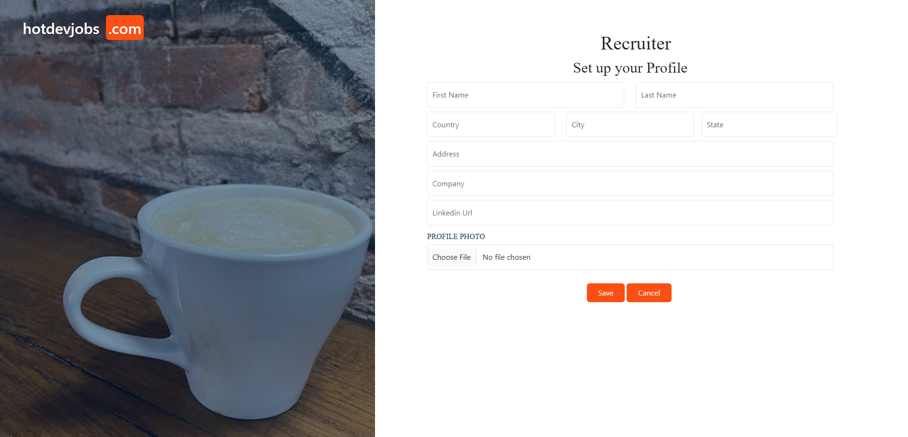
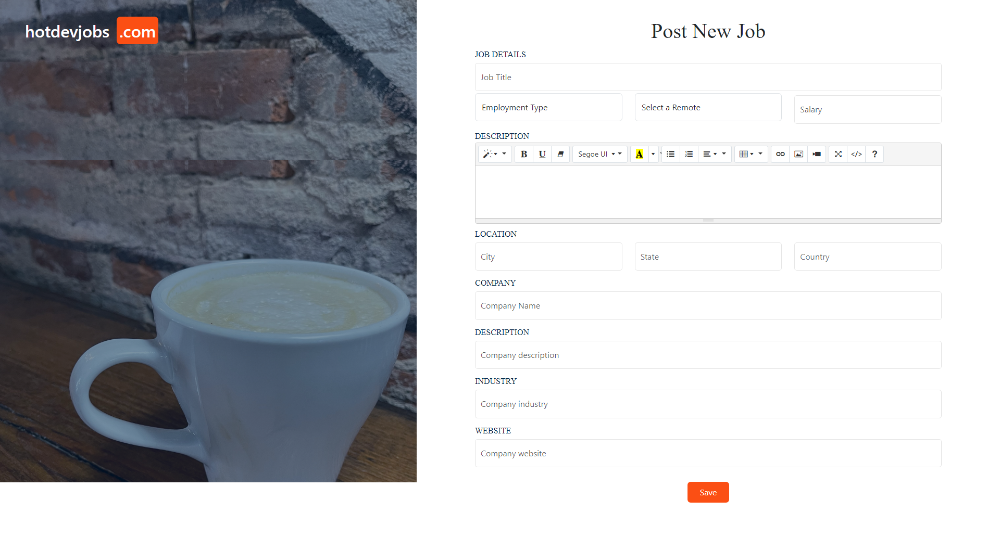
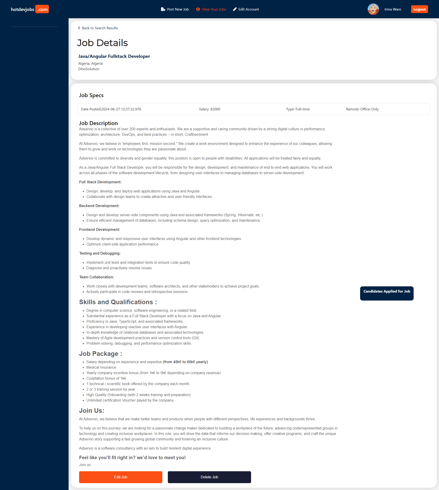
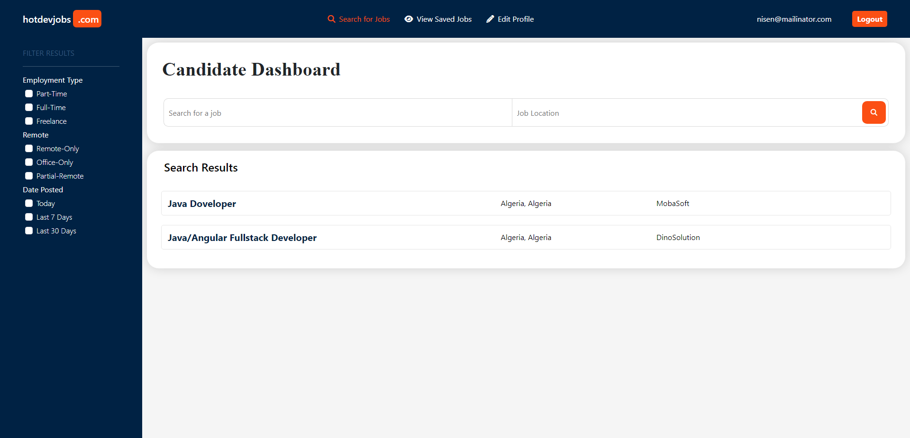
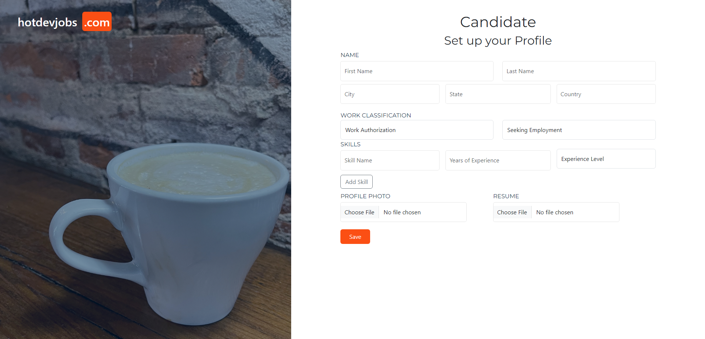
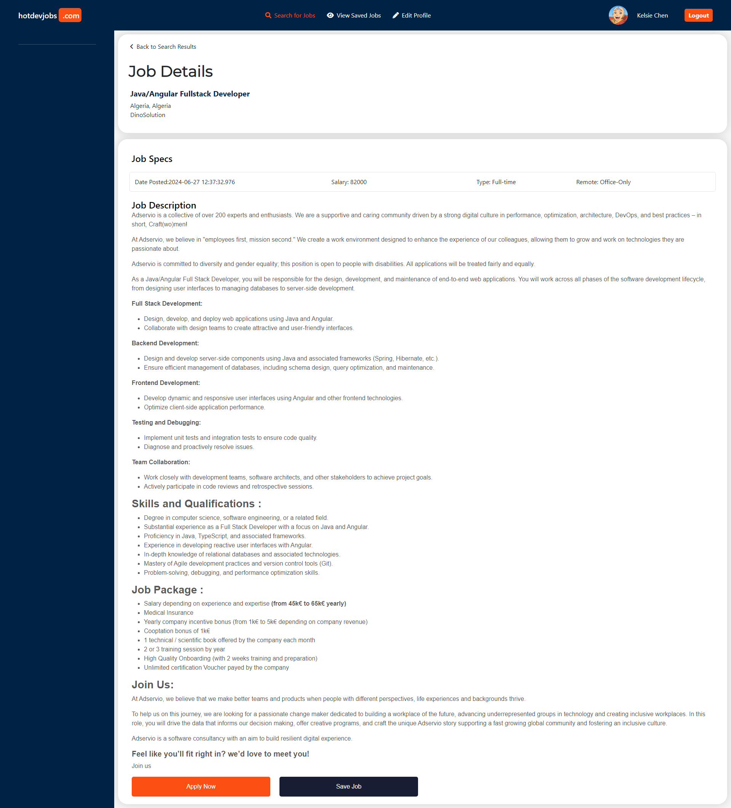
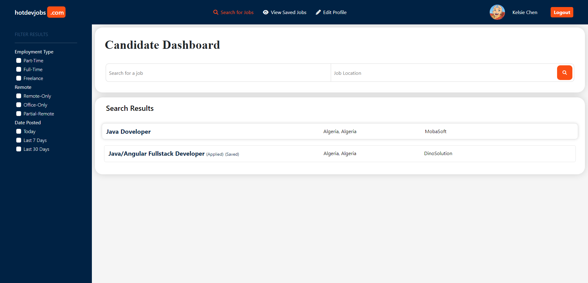
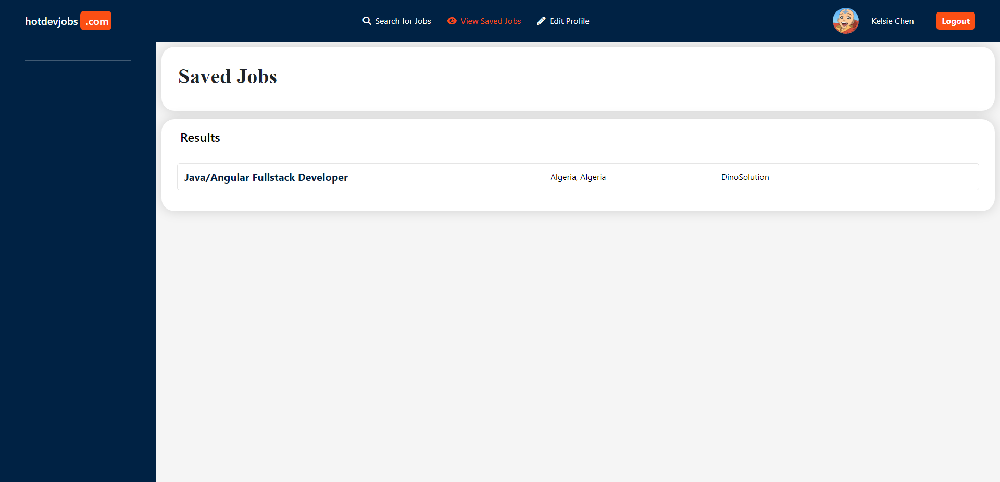

# Job Portal Web Application
##### Using  Spring Boot V3 & Thymeleaf


### About
The Job Portal Web Application is a dynamic online platform built using Spring Boot and Thymeleaf, designed to connect job seekers and recruiters. It streamlines the job search and recruitment process, providing a feature-rich environment for job seekers and recruiters to interact, post job vacancies, apply for jobs, and manage their profiles.

## Features

- **User Roles:** The application supports two primary user roles, "Job Seekers" and "Recruiter," each with distinct features and capabilities.
- **Job Listings:** Job seekers can browse and search through a comprehensive list of job vacancies posted by various recruiters. The listings can be filtered by categories, locations, and other criteria.
- **Application Process:** Job seekers can seamlessly apply for jobs by submitting their resumes and cover letters, while recruiters can review applications, contact applicants, and schedule interviews.
- **Bookmarks/Save Job:** Job seekers have the ability to bookmark job vacancies, allowing them to save and revisit job opportunities that interest them.
- **User Profiles:** Both job seekers and recruiters can create and manage detailed profiles, including personal information, work experience, and educational backgrounds.
- **Education Details:** Job seekers can provide comprehensive information about their educational background, including schools, degrees, majors, graduation years, and GPAs.
- **Secure Authentication:** The application implements user registration and authentication to ensure data and account security.
- **Responsive Design:** The web application is designed to be responsive, ensuring a seamless experience on various devices, including desktops, tablets, and smartphones.


## Installation

Job Portal Web Application requires JavaJdk V17+ to run.

#### Server
```sh
cd airbnb-clone-server
mvn clean install
## //On target folder ru this command
java -jar job-portal-web-application-0.0.1-SNAPSHOT.jar
```

#### Docker
```sh
cd airbnb-clone-server
docker compose build
docker compose up
```

#### Interact with MySQL container
```sh
# display runing containers
dokcer ps
docker exec -it container_id_or_name bash
mysql -u mrabdelaaziz --password=password
show databases;
# selecting our database
use job_portal_web_application;
show tables;
select * from users_types;
select * from users;
exit
exit
```
[⬆ back to top](#job-portal-web-application)

## Screenshots
##### Home Page

[⬆ back to top](#job-portal-web-application)

##### Login Page (Both job seekers and recruiters)

[⬆ back to top](#job-portal-web-application)

##### Recruiter dashboard

[⬆ back to top](#job-portal-web-application)

##### Recruiter profile

[⬆ back to top](#job-portal-web-application)

##### Recruiter posting a new job

[⬆ back to top](#job-portal-web-application)

##### Recruiter displaying job details

[⬆ back to top](#job-portal-web-application)

##### Candidate dashboard

[⬆ back to top](#job-portal-web-application)

##### Candidate profile

[⬆ back to top](#job-portal-web-application)

##### Candidate displaying job details

[⬆ back to top](#job-portal-web-application)

##### Candidate displaying jobs list after applying for a job

[⬆ back to top](#job-portal-web-application)

##### Candidate displaying sqved jobs

[⬆ back to top](#job-portal-web-application)
## License

MIT

**Free Software, Hell Yeah!**
